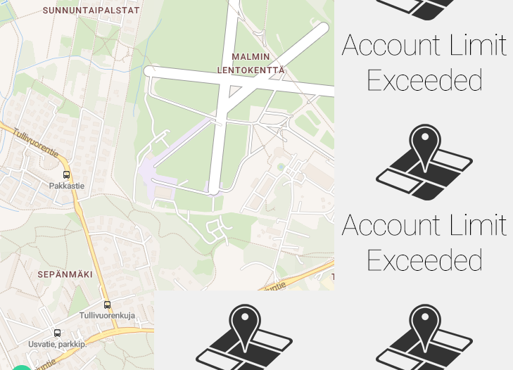

# solita-dev-academy

**My submission for the Solita Dev Academy 2024**

See the assignment at https://github.com/solita/dev-academy-spring-2024-exercise

## Live demo

https://academy.kaivola.cloud

## Running instructions

<details>
    <summary>Requirements</summary>

- Git
- Docker
- Node
- npm
- Unix-like OS (or WSL2 or Git Bash)

**Also make sure that you have the provided database running. If not, please follow the steps in the [assignment repository](https://github.com/solita/dev-academy-spring-2024-exercise) to get it set up and running.**
</details>

### Building
<details>
<summary>Using the provided script</summary>

Clone, build, and run both the backend and the frontend by running:

```
./run.sh
```

If the script didn't fail you can now access the app at http://localhost:3000
</details>

<details>
<summary>Manually</summary>

Optionally you can also set up the app manually:

**Backend**

Clone the repo:
```
 git clone git@github.com:kaivola/solita-dev-academy-backend.git
```
Change into the cloned dir and build and run the Docker image:
```
docker compose up --build --force-recreate -d
```
Backend should now be listening at port 8080

**Frontend**

Clone the repo:
```
 git clone git@github.com:kaivola/solita-dev-academy-frontend.git
```
Change into the cloned dir and after that install dependencies:
```
npm i
```
After all the dependencies have installed you can finally build the frontend:
```
npm run build
```
After the build finishes successfully you can start serving the frontend:
```
npm run start
```
The app should now be accessible at http://localhost:3000

</details>

## Tech stack
### Frontend
Frontend repo at https://github.com/kaivola/solita-dev-academy-frontend
- React
- Next.js 13
- TypeScript
- Tailwind CSS
- Leaflet

### Backend
Backend repo at https://github.com/kaivola/solita-dev-academy-backend
- Java
- Spring Boot

## Features implemented
### Station list
✅ List all stations

✅ Link to single station views

✅ Sort by distance from the user

### Single station view
✅ Station name

✅ Station address

✅ Total number of journeys starting from the station

✅ Total number of journeys ending at the station

✅ Average distance of journeys starting from the station

✅ Avarage duration of journeys starting from the station

✅ Top 5 destination stations

## Notes
In case the error seen in the picture happens, just wait a few seconds and refresh the page and the error should be gone.
This happens because the map tiling provider has rate limits for free tier customers.

